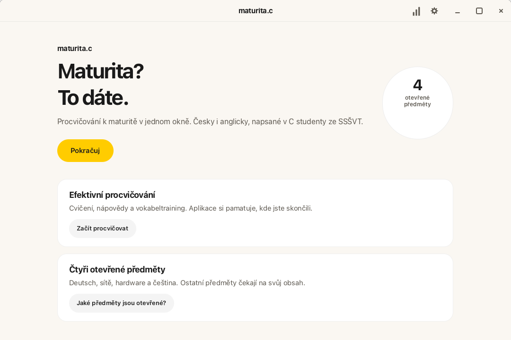
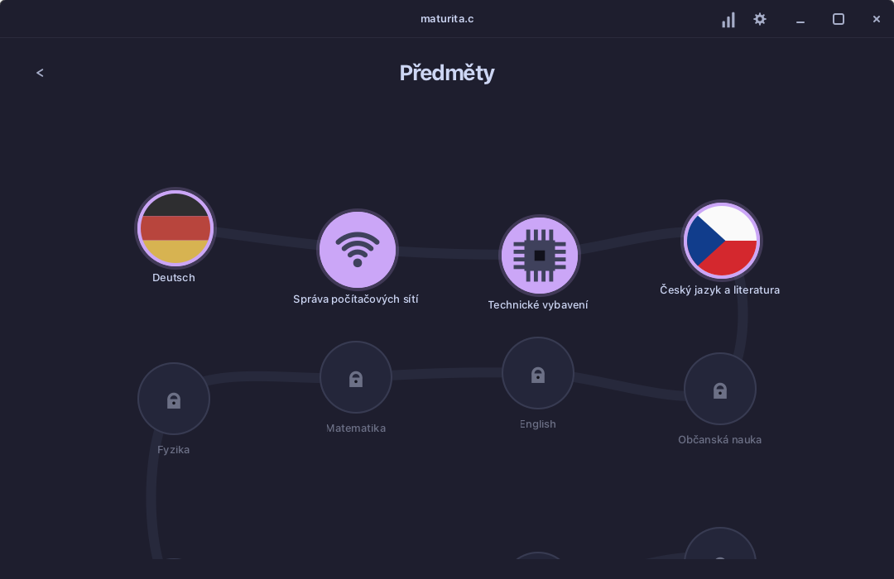
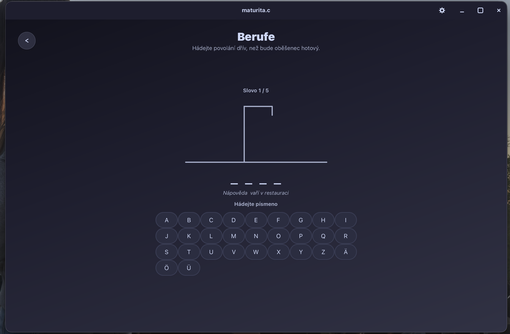

# Graduately

Vzdělávací aplikace k přípravě na maturitu (repo `Graduately`). / An educational app for the Czech maturita exam (repo `Graduately`).

**[Česky](#česky)** · **[English](#english)**

---

## Česky

Rozhraní je v češtině a angličtině. Hotové jsou čtyři předměty; ostatní jsou
zatím zamčené placeholdery. Aplikace se po instalaci aktualizuje sama.

| Úvod | Předměty | Německá cesta |
| ---- | -------- | ------------- |
|  |  |  |

### Instalace

Žádné releasy ani čísla verzí nejsou. CI po každém pushi na `main` uloží
balíčky do větve [`builds`](https://github.com/pepaskopec-blip/Graduately/tree/builds).
Instalátor samotnou aplikaci neobsahuje — při spuštění si dohledá aktuální
commit větve `builds` a stáhne ten soubor, ne kešovanou kopii podle názvu
větve.

**Stáhni zip, rozbal ho a otevři instalátor.** Nic víc (žádný Terminál):

| Platforma | Soubor | Jak spustit |
| --------- | ------ | ----------- |
| macOS (Apple Silicon) | [graduately-installer-macos.zip](https://github.com/pepaskopec-blip/Graduately/raw/main/installers/graduately-installer-macos.zip) | Rozbalit, pravý klik na **Nainstalovat Graduately** → **Otevřít** |
| Windows (x64) | [graduately-installer-windows.zip](https://github.com/pepaskopec-blip/Graduately/raw/main/installers/graduately-installer-windows.zip) | Rozbalit a dvojklik; u SmartScreenu **Další informace → Přesto spustit** |
| Linux (x86_64) | [graduately-installer-linux.zip](https://github.com/pepaskopec-blip/Graduately/raw/main/installers/graduately-installer-linux.zip) | Rozbalit a dvojklik na instalátor |
| Android (8+) | [graduately-installer-android.zip](https://github.com/pepaskopec-blip/Graduately/raw/main/installers/graduately-installer-android.zip) | Rozbalit, otevřít **Stahnout Graduately.html** a nainstalovat APK (neznámé zdroje) |
| iOS (26+) | [graduately-installer-ios.zip](https://github.com/pepaskopec-blip/Graduately/raw/main/installers/graduately-installer-ios.zip) | Rozbalit, otevřít **Jak nainstalovat Graduately.html**. Nejjednodušší: Xcode na Macu, nebo IPA přes AltStore |

Kam se to nainstaluje: `/Applications` nebo `~/Applications` (macOS),
`%LOCALAPPDATA%\Programs\Graduately` (Windows), `~/Applications` (Linux).

Buildy zatím nejsou notarizované (chybí Apple Developer ID), proto je při
**prvním** spuštění potřeba výše uvedený krok navíc. Aplikace se pak udržuje
sama: po startu porovná svůj commit se souborem `VERSION` ve větvi `builds`
a aktualizaci nabídne v pruhu nahoře. Ruční kontrola je
v **Nastavení → Aktualizace**.

#### Bez instalátoru

Na větvi [`builds`](https://github.com/pepaskopec-blip/Graduately/tree/builds)
jsou i hotové balíčky. Odkazy podle názvu větve umí CDN kešovat, proto je
spolehlivější instalátor výše, nebo stažení přímo z té stránky větve:

- [graduately-macos-arm64.zip](https://github.com/pepaskopec-blip/Graduately/raw/builds/graduately-macos-arm64.zip)
- [graduately-windows-x64.zip](https://github.com/pepaskopec-blip/Graduately/raw/builds/graduately-windows-x64.zip)
- [graduately-linux-x86_64.AppImage](https://github.com/pepaskopec-blip/Graduately/raw/builds/graduately-linux-x86_64.AppImage)
- [graduately-android.apk](https://github.com/pepaskopec-blip/Graduately/raw/refs/heads/builds/graduately-android.apk)
- [graduately-ios.ipa](https://github.com/pepaskopec-blip/Graduately/raw/refs/heads/builds/graduately-ios.ipa)

Postup a nastavení se ukládají vedle `.app` / složky / AppImage do `progress/`.
Na Androidu, iOS a macOS do úložiště aplikace (stejné statistiky, témata a jazyk).

Intel Mac, jiná architektura nebo úpravy kódu → [sestavení ze zdroje](#sestavení-ze-zdroje).

### Co v aplikaci je

- **Deutsch** — 3 otevřené jednotky (Neue Freunde, Aus aller Welt, Bei uns zu
  Hause): cvičení, nápovědy, vokabeltraining
- **Správa počítačových sítí** — 1. ročník, 27 lekcí (VLSM + teorie a kvízy);
  ročníky 2–4 jsou zamčené
- **Technické vybavení** — 29 lekcí (architektura, data, skříň a deska, karty, disky, vstupní zařízení)
- **Český jazyk a literatura** — mluvnice (20 cvičení) a maturitní četba
  (82 knih: zápisky, kvíz, sestavení děje); literární teorie je zatím zamčená
- statistiky, hledání (lupa nebo `Cmd/Ctrl+K`), 10 témat, tmavý/světlý režim, čeština/angličtina
- ukončení: `Cmd/Super+Q` nebo `Alt+F4`

### Použití

1. **Pokračuj** otevře mapu předmětů.
2. Otevřený předmět (vlajka, Wi‑Fi, čip, česká vlajka) vede na učební cestu.
3. Uzly cvičení / lekcí otevřou obsah; zamčené nic nedělají.
4. **Hledat** (lupa), **Statistiky** (graf) a **Nastavení** (ozubené kolo) jsou vpravo nahoře.

### Sestavení ze zdroje

macOS je nativní SwiftUI aplikace (Xcode 26, macOS 26+). Linux a Windows
zůstávají GTK 4.

```bash
# macOS
# Xcode 26 z App Storu; žádné GTK

# Debian / Ubuntu
sudo apt install build-essential pkg-config libgtk-4-dev

# Fedora
sudo dnf install gcc make pkgconf-pkg-config gtk4-devel

# Arch
sudo pacman -S base-devel pkgconf gtk4
```

```bash
git clone https://github.com/pepaskopec-blip/Graduately.git
cd Graduately
```

Na Macu:

```bash
open Maturita.xcworkspace          # scheme Maturita z macos/Maturita.xcodeproj
# nebo: make bundle                # zip v dist/graduately-macos-arm64.zip
```

Na Linuxu a Windows:

```bash
make
make run          # nebo ./graduately
make bundle       # AppImage / Windows složka s DLL
make smoke        # instalátory, content packs, dostupnost builds
```

Volitelně CMake (GTK): `cmake -S . -B build && cmake --build build`.

Na macOS `make bundle` automaticky vloží aktuální Git commit, aby fungovala
kontrola aktualizací. Při balení ze zdrojů bez `.git` zadejte
`COMMIT=<zdrojový-commit> make bundle`.

Aby stažená aplikace na macOS šla otevřít bez potvrzení v Nastavení, CI
potřebuje **Apple Developer Program** a GitHub Secrets:

- `MACOS_CERTIFICATE` — Developer ID Application `.p12` v base64
- `MACOS_CERTIFICATE_PASSWORD`
- `APPLE_API_KEY`, `APPLE_API_KEY_ID`, `APPLE_API_ISSUER` — notarizace
  (nebo `APPLE_ID` + `APPLE_APP_SPECIFIC_PASSWORD` + `APPLE_TEAM_ID`)

Bez toho zůstane jen ad-hoc podpis a Gatekeeper stažený build zablokuje.

#### Windows (MSYS2 UCRT64, bez Visual Studia)

```cmd
winget install --id MSYS2.MSYS2 -e --source winget
C:\msys64\ucrt64.exe pacman -S --noconfirm mingw-w64-ucrt-x86_64-gcc mingw-w64-ucrt-x86_64-gtk4 mingw-w64-ucrt-x86_64-pkg-config make
```

V terminálu **MSYS2 UCRT64**:

```bash
cd /c/Users/<jméno>/Graduately  # C:\Users\<jméno>\Graduately v MSYS2
make
./graduately.exe
make bundle                     # dist/graduately.exe jde spustit i z Průzkumníka
```

### Struktura

```
src/                 C zdroje (GTK přehrávač pro Linux a Windows)
android/             Jetpack Compose přehrávač (stejný obsah)
ios/                 SwiftUI přehrávač (stejný obsah)
macos/               nativní SwiftUI aplikace pro Mac (stejný obsah)
data/                style.css, changelog.txt, share/, cetba/*.json
assets/              zdrojová ikona a screenshoty
installers/          instalátory, které stáhnou aktuální build
scripts/             balení AppImage, .app, IPA, extract a smoke test
.github/workflows/   CI: push na main → větev builds
progress/            vzniká za běhu (cvičení, nastavení)
```

Android ze zdroje (JDK 17 + Android SDK):

```bash
python3 scripts/extract-android-content.py
cd android
./gradlew :app:assembleRelease
# APK: android/app/build/outputs/apk/release/app-release.apk
```

nebo z kořene `make android`.

APK se podepisuje klíčem `android/keystore/sideload.jks` (není tajný – jde o
sideload, ne o Google Play), aby aktualizace z aplikace šla nainstalovat přes
předchozí build. Vlastní klíč lze dodat přes `MATURITA_KEYSTORE` a
`MATURITA_KEYSTORE_PASSWORD`. Buildy `android-5` a starší mají jiný podpis –
jednou odinstalujte a nainstalujte znovu.

iOS ze zdroje (Xcode 26, iOS 26+ / Liquid Glass):

```bash
open Maturita.xcworkspace          # v kořeni repozitáře
# Simulátor: vyber iPhone a Run, nic dalšího není potřeba (obsah se
# vytáhne z C zdrojů při buildu). Na iPhone: v Signing vyber svůj Team.
# nebo: make ios   # unsigned IPA v dist-ios/graduately-ios.ipa
```

Workspace odkazuje na `ios/Maturita.xcodeproj` a `macos/Maturita.xcodeproj`.
Projekty nepřesouvejte – build čte `../src` a `../scripts` a v kořeni by
`Maturita/` kolidovalo se zkompilovaným binárem `graduately`.

Licence: [GPL-3.0](LICENSE).

---

## English

The UI is Czech and English. Four subjects are playable; the rest are locked
placeholders. After install the app updates itself.

| Welcome | Subjects | German path |
| ------- | -------- | ----------- |
|  |  |  |

### Install

There are no releases and no version numbers. CI writes packages to the
[`builds`](https://github.com/pepaskopec-blip/Graduately/tree/builds) branch
whenever `main` changes. The installer carries no app of its own — it fetches
the current `builds` commit when you run it, not a CDN-cached copy of the
branch-named file.

**Download the zip, unzip it, and open the installer.** No Terminal:

| Platform | File | How to run |
| -------- | ---- | ---------- |
| macOS (Apple Silicon) | [graduately-installer-macos.zip](https://github.com/pepaskopec-blip/Graduately/raw/main/installers/graduately-installer-macos.zip) | Unzip, right-click **Nainstalovat Graduately** → **Open** |
| Windows (x64) | [graduately-installer-windows.zip](https://github.com/pepaskopec-blip/Graduately/raw/main/installers/graduately-installer-windows.zip) | Unzip and double-click; if SmartScreen appears, **More info → Run anyway** |
| Linux (x86_64) | [graduately-installer-linux.zip](https://github.com/pepaskopec-blip/Graduately/raw/main/installers/graduately-installer-linux.zip) | Unzip and double-click the installer |
| Android (8+) | [graduately-installer-android.zip](https://github.com/pepaskopec-blip/Graduately/raw/main/installers/graduately-installer-android.zip) | Unzip, open **Stahnout Graduately.html**, then install the APK (unknown sources) |
| iOS (26+) | [graduately-installer-ios.zip](https://github.com/pepaskopec-blip/Graduately/raw/main/installers/graduately-installer-ios.zip) | Unzip, open **Jak nainstalovat Graduately.html**. Easiest: Xcode on a Mac, or the IPA via AltStore |

Install locations: `/Applications` or `~/Applications` (macOS),
`%LOCALAPPDATA%\Programs\Graduately` (Windows), `~/Applications` (Linux).

The builds are not notarized yet (no Apple Developer ID), so the first
launch still needs the extra step above. After that the app stays current:
it compares its commit to `VERSION` on `builds` and offers an update in a
banner. Manual check: **Settings → Updates**.

#### Packages without the installer

The same files live on
[`builds`](https://github.com/pepaskopec-blip/Graduately/tree/builds).
Branch-named raw URLs can be cached by the CDN, so prefer the installer
above, or download from that branch page:

- [graduately-macos-arm64.zip](https://github.com/pepaskopec-blip/Graduately/raw/builds/graduately-macos-arm64.zip)
- [graduately-windows-x64.zip](https://github.com/pepaskopec-blip/Graduately/raw/builds/graduately-windows-x64.zip)
- [graduately-linux-x86_64.AppImage](https://github.com/pepaskopec-blip/Graduately/raw/builds/graduately-linux-x86_64.AppImage)
- [graduately-android.apk](https://github.com/pepaskopec-blip/Graduately/raw/refs/heads/builds/graduately-android.apk)
- [graduately-ios.ipa](https://github.com/pepaskopec-blip/Graduately/raw/refs/heads/builds/graduately-ios.ipa)

Progress and settings live in `progress/` next to the `.app` / folder /
AppImage. On Android, iOS and macOS they stay in app storage (same stats, themes, language).

Intel Mac, another architecture, or hacking on the code →
[build from source](#build-from-source).

### What’s inside

- **Deutsch** — 3 open units (Neue Freunde, Aus aller Welt, Bei uns zu Hause):
  exercises, hints, vocabulary training
- **Computer networks** — year 1, 27 lessons (VLSM + theory/quizzes);
  years 2–4 are locked
- **Computer hardware** — 29 lessons (architecture, data, case and board, cards, drives, input devices)
- **Czech language** — grammar (20 exercises) and required reading
  (82 books: notes, quiz, plot ordering); literature theory is still locked
- statistics, search (magnifier or `Cmd/Ctrl+K`), 10 palettes, dark/light mode, Czech/English
- quit with `Cmd/Super+Q` or `Alt+F4`

### Usage

1. **Continue** opens the subject map.
2. An open subject (flag, Wi‑Fi, chip, Czech flag) opens its path.
3. Exercise / lesson nodes open content; locked nodes do nothing.
4. **Search** (magnifier), **Statistics** (chart) and **Settings** (gear) sit in the top-right.

### Build from source

macOS is a native SwiftUI app (Xcode 26, macOS 26+). Linux and Windows
stay on GTK 4.

```bash
# macOS
# Xcode 26 from the App Store; no GTK

# Debian / Ubuntu
sudo apt install build-essential pkg-config libgtk-4-dev

# Fedora
sudo dnf install gcc make pkgconf-pkg-config gtk4-devel

# Arch
sudo pacman -S base-devel pkgconf gtk4
```

```bash
git clone https://github.com/pepaskopec-blip/Graduately.git
cd Graduately
```

On a Mac:

```bash
open Maturita.xcworkspace          # scheme Maturita from macos/Maturita.xcodeproj
# or: make bundle                  # zip at dist/graduately-macos-arm64.zip
```

On Linux and Windows:

```bash
make
make run          # or ./graduately
make bundle       # AppImage / Windows DLL folder
make smoke        # installers, content packs, builds availability
```

Optional CMake (GTK): `cmake -S . -B build && cmake --build build`.

On macOS, `make bundle` embeds the current Git commit so the installed app
can check for updates. When packaging a source export without `.git`, use
`COMMIT=<source-commit> make bundle`.

Skipping Gatekeeper on a downloaded macOS build needs an
**Apple Developer Program** membership and these GitHub Secrets:

- `MACOS_CERTIFICATE` — Developer ID Application `.p12`, base64-encoded
- `MACOS_CERTIFICATE_PASSWORD`
- `APPLE_API_KEY`, `APPLE_API_KEY_ID`, `APPLE_API_ISSUER` for notarization
  (or `APPLE_ID` + `APPLE_APP_SPECIFIC_PASSWORD` + `APPLE_TEAM_ID`)

Without them the bundle stays ad-hoc signed and Gatekeeper still blocks it.

#### Windows (MSYS2 UCRT64, no Visual Studio)

```cmd
winget install --id MSYS2.MSYS2 -e --source winget
C:\msys64\ucrt64.exe pacman -S --noconfirm mingw-w64-ucrt-x86_64-gcc mingw-w64-ucrt-x86_64-gtk4 mingw-w64-ucrt-x86_64-pkg-config make
```

In an **MSYS2 UCRT64** terminal:

```bash
cd /c/Users/<name>/Graduately   # C:\Users\<name>\Graduately in MSYS2
make
./graduately.exe
make bundle                     # dist/graduately.exe can be double-clicked
```

### Layout

```
src/                 C sources (GTK player for Linux and Windows)
android/             Jetpack Compose player (same content)
ios/                 SwiftUI player (same content)
macos/               native SwiftUI Mac app (same content)
data/                style.css, changelog.txt, share/, cetba/*.json
assets/              source icon and screenshots
installers/          fetch-the-latest installers
scripts/             AppImage / .app / IPA bundlers, extract, smoke test
.github/workflows/   CI: push to main → builds branch
progress/            created at runtime (exercises, settings)
```

Android from source (JDK 17 + Android SDK):

```bash
python3 scripts/extract-android-content.py
cd android
./gradlew :app:assembleRelease
# APK: android/app/build/outputs/apk/release/app-release.apk
```

or `make android` from the repo root.

The APK is signed with `android/keystore/sideload.jks` (not a secret – this is
a sideloaded app, not a Play release) so in-app updates install over the
previous build. Supply your own key through `MATURITA_KEYSTORE` and
`MATURITA_KEYSTORE_PASSWORD`. Builds `android-5` and older carry a different
signature – uninstall once and install again.

iOS from source (Xcode 26, iOS 26+ / Liquid Glass):

```bash
open Maturita.xcworkspace          # at the repo root
# Simulator: pick an iPhone and Run, nothing else needed (content is
# extracted from the C sources during the build). Device: pick your Team.
# or: make ios   # unsigned IPA at dist-ios/graduately-ios.ipa
```

The workspace points at `ios/Maturita.xcodeproj` and `macos/Maturita.xcodeproj`.
Do not move the projects – the build reads `../src` and `../scripts`, and at
the root `Maturita/` would collide with the compiled `maturita` binary.

License: [GPL-3.0](LICENSE).
