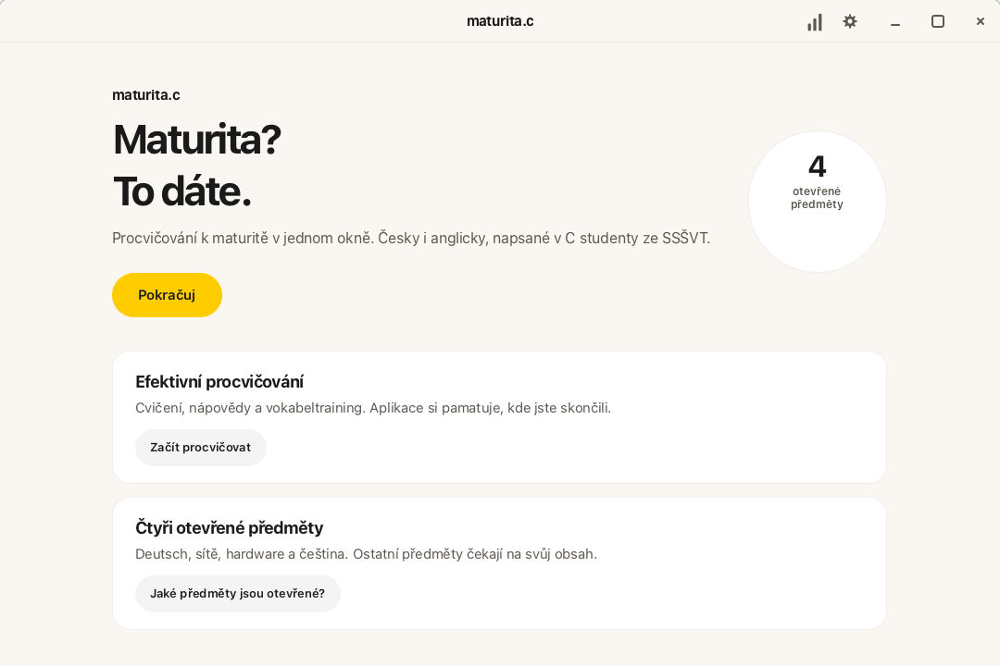
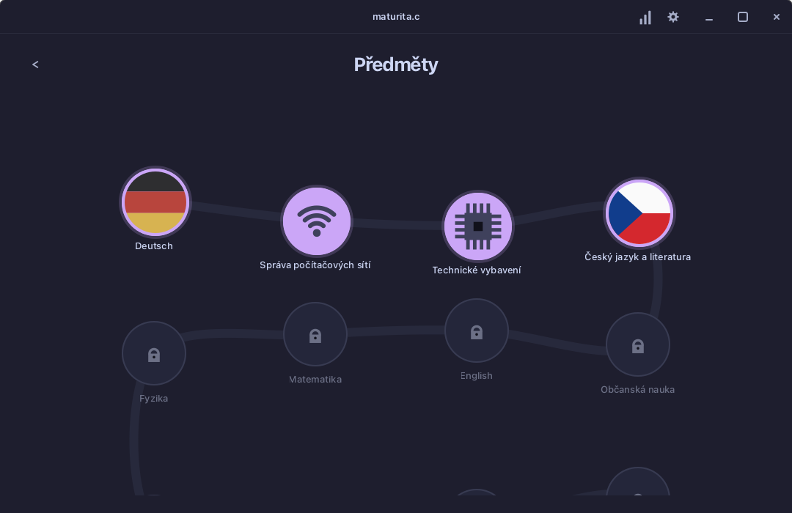
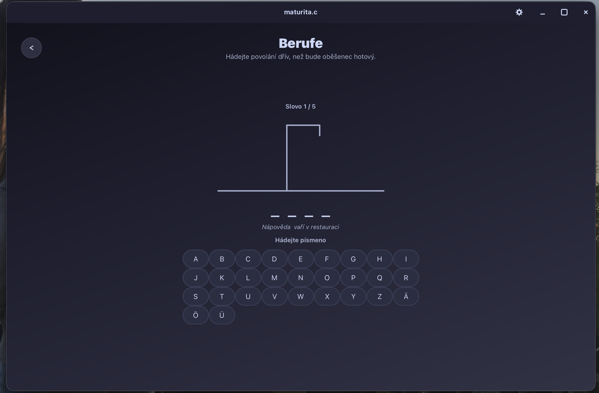

# Graduately

Vzdělávací aplikace k přípravě na maturitu (repo `Graduately`). / An educational app for the Czech maturita exam (repo `Graduately`).

**[Česky](#česky)** · **[English](#english)**

---

## Česky

Rozhraní je v češtině a angličtině. Otevřené předměty jsou v seznamu níže;
ostatní jsou zatím zamčené. Aplikace se po instalaci aktualizuje sama.

| Úvod | Předměty | Německá cesta |
| ---- | -------- | ------------- |
|  |  |  |

### Instalace

Žádné releasy ani čísla verzí nejsou. CI po každém pushi na `main` uloží
balíčky do větve [`builds`](https://github.com/pepaskopec-blip/Graduately/tree/builds).
Instalátor samotnou aplikaci neobsahuje — při spuštění si dohledá aktuální
commit větve `builds` a stáhne ten soubor, ne kešovanou kopii podle názvu
větve.

**Stáhni zip, rozbal ho a otevři instalátor.** Nic víc (žádný Terminál):

| Platforma | Soubor | Jak spustit |
| --------- | ------ | ----------- |
| macOS (Apple Silicon) | [graduately-installer-macos.zip](https://github.com/pepaskopec-blip/Graduately/raw/main/installers/graduately-installer-macos.zip) | Rozbalit, pravý klik na **Nainstalovat Graduately** → **Otevřít** |
| Windows (x64) | [graduately-installer-windows.zip](https://github.com/pepaskopec-blip/Graduately/raw/main/installers/graduately-installer-windows.zip) | Rozbalit a dvojklik; u SmartScreenu **Další informace → Přesto spustit** |
| Linux (x86_64) | [graduately-installer-linux.zip](https://github.com/pepaskopec-blip/Graduately/raw/main/installers/graduately-installer-linux.zip) | Rozbalit a dvojklik na instalátor |
| Android (8+) | [graduately-installer-android.zip](https://github.com/pepaskopec-blip/Graduately/raw/main/installers/graduately-installer-android.zip) | Rozbalit, otevřít **Stahnout Graduately.html** a nainstalovat APK (neznámé zdroje) |
| iOS (26+) | [graduately-installer-ios.zip](https://github.com/pepaskopec-blip/Graduately/raw/main/installers/graduately-installer-ios.zip) | Rozbalit, otevřít **Jak nainstalovat Graduately.html**. Nejjednodušší: Xcode na Macu, nebo IPA přes AltStore |

Kam se to nainstaluje: `/Applications` nebo `~/Applications` (macOS),
`%LOCALAPPDATA%\Programs\Graduately` (Windows), `~/Applications` (Linux).

Buildy zatím nejsou notarizované (chybí Apple Developer ID), proto je při
**prvním** spuštění potřeba výše uvedený krok navíc. Aplikace se pak udržuje
sama: po startu porovná svůj commit se souborem `VERSION` ve větvi `builds`
a aktualizaci nabídne v pruhu nahoře. Ruční kontrola je
v **Nastavení → Aktualizace**.

#### Bez instalátoru

Na větvi [`builds`](https://github.com/pepaskopec-blip/Graduately/tree/builds)
jsou i hotové balíčky. Odkazy podle názvu větve umí CDN kešovat, proto je
spolehlivější instalátor výše, nebo stažení přímo z té stránky větve:

- [graduately-macos-arm64.zip](https://github.com/pepaskopec-blip/Graduately/raw/builds/graduately-macos-arm64.zip)
- [graduately-windows-x64.zip](https://github.com/pepaskopec-blip/Graduately/raw/builds/graduately-windows-x64.zip)
- [graduately-linux-x86_64.AppImage](https://github.com/pepaskopec-blip/Graduately/raw/builds/graduately-linux-x86_64.AppImage)
- [graduately-android.apk](https://github.com/pepaskopec-blip/Graduately/raw/refs/heads/builds/graduately-android.apk)
- [graduately-ios.ipa](https://github.com/pepaskopec-blip/Graduately/raw/refs/heads/builds/graduately-ios.ipa)

Na Linuxu a Windows se postup a nastavení ukládají do `progress/` vedle
AppImage / ve složce aplikace; postup ze starší GTK verze se při prvním
spuštění převezme. Na Androidu, iOS a macOS do úložiště aplikace (stejné
statistiky, témata a jazyk).

Intel Mac, jiná architektura nebo úpravy kódu → [sestavení ze zdroje](#sestavení-ze-zdroje).

### Co v aplikaci je

- **Deutsch** — učebnice (Neue Freunde, Aus aller Welt, Bei uns zu Hause)
  a 4 ročníky, 24 lekcí od A1 k B1: poslech, čtení, psaní, doplňování a kvízy
- **Správa počítačových sítí** — 4 ročníky: 1. ročník má 27 lekcí
  (adresy, modely, přepínače a bezdrát), ročníky 2–4 po 8 lekcích
  (VLAN, směrování, firewall, návrh a maturita)
- **Technické vybavení** — 4 ročníky: 1. ročník má 29 lekcí
  (architektura, data, skříň, deska, karty, disky a vstup),
  ročníky 2–4 po 8 lekcích (monitory, sestavení, RAID, servery, údržba)
- **Český jazyk a literatura** — literatura (4 ročníky, 32 lekcí podle osnov
  středních škol), mluvnice (20 cvičení) a maturitní četba
  (82 knih: zápisky, kvíz, sestavení děje)
- **Matematika** — opakování základní školy a 4 ročníky, 40 lekcí;
  příklady se píšou a kontrolují, u geometrie jde i rýsovat na mřížku
- **Fyzika** — 4 ročníky, 32 lekcí podle osnov středních škol
  (mechanika, teplo a vlny, elektřina a magnetismus, optika až astrofyzika)
- **Základy přírodních věd** — chemie a biologie, v každé 8 lekcí
  (od atomu a buňky po biochemii a ekologii) s výkladem a kvízem
- **Občanská nauka** — 1. ročník, 17 lekcí (člověk v lidském společenství);
  2. ročník, 16 lekcí (člověk jako občan); 3. ročník, 16 lekcí (člověk a právo);
  4. ročník, 16 lekcí (hospodářství, svět a filozofie)
- **Angličtina** — 4 ročníky, 32 lekcí podle osnov gymnázia (A2 až maturita):
  poslech, čtení, psaní, doplňování, kvízy a ročníkové testy
- statistiky, hledání (lupa nebo `Cmd/Ctrl+K`), 10 témat, tmavý/světlý režim, čeština/angličtina
- ukončení: `Ctrl/Cmd+Q` nebo `Alt+F4`, zpět: `Esc`

### Použití

1. **Pokračuj** otevře mapu předmětů.
2. Otevřený předmět (vlajka, Wi‑Fi, čip, česká vlajka, váhy, funkce, atom, baňka) vede na učební cestu.
3. Uzly cvičení / lekcí otevřou obsah; zamčené nic nedělají.
4. **Hledat** (lupa), **Statistiky** (graf) a **Nastavení** (ozubené kolo) jsou vpravo nahoře.

### Sestavení ze zdroje

Dvě kódové základny, jeden obsah (`content/`) a společné testy (`tests/`):

- **Kotlin + Compose** (`android/`): Android, Linux a Windows. Obrazovky,
  cvičení a kontrola odpovědí jsou v `android/shared/`, platformy se liší jen
  vstupním bodem (`android/app`, `android/desktop`).
- **Swift + SwiftUI** (`ios/`, `macos/`): iPhone a Mac (Xcode 26, macOS 26+).

```bash
git clone https://github.com/pepaskopec-blip/Graduately.git
cd Graduately
make test         # kontrola odpovědí v Kotlinu (a ve Swiftu, je-li Xcode)
```

Linux, Windows (i Mac pro vývoj) — stačí JDK 17+ a Python 3:

```bash
make run          # spustí desktopovou aplikaci ze zdroje
make linux        # dist/graduately-linux-x86_64.AppImage
make windows      # dist/graduately-windows-x64.zip (v Git Bash)
make smoke        # instalátory, obsah, testy, dostupnost builds
```

Na balení (`make linux` / `make windows`) je potřeba JDK s `jmods`, např.
Temurin 21; cestu k němu předejte v `PACKAGE_JDK`. ProGuard zmenší balíček
pod limit GitHubu 100 MB.

Na Macu:

```bash
open Graduately.xcworkspace        # scheme Graduately z macos/Graduately.xcodeproj
# nebo: make macos                 # zip v dist/graduately-macos-arm64.zip
```

Na macOS `make macos` automaticky vloží aktuální Git commit, aby fungovala
kontrola aktualizací. Při balení ze zdrojů bez `.git` zadejte
`COMMIT=<zdrojový-commit> make macos`.

Aby stažená aplikace na macOS šla otevřít bez potvrzení v Nastavení, CI
potřebuje **Apple Developer Program** a GitHub Secrets:

- `MACOS_CERTIFICATE` — Developer ID Application `.p12` v base64
- `MACOS_CERTIFICATE_PASSWORD`
- `APPLE_API_KEY`, `APPLE_API_KEY_ID`, `APPLE_API_ISSUER` — notarizace
  (nebo `APPLE_ID` + `APPLE_APP_SPECIFIC_PASSWORD` + `APPLE_TEAM_ID`)

Bez toho zůstane jen ad-hoc podpis a Gatekeeper stažený build zablokuje.

### Struktura

```
content/             texty lekcí, cvičení a knih v Markdownu (viz content/README.md)
android/shared/      společný Kotlin: obrazovky, cvičení, kontrola odpovědí, postup
android/app/         Android (vstupní bod, aktualizace APK, předčítání)
android/desktop/     Linux a Windows (okno, aktualizace, předčítání, import z GTK)
ios/                 SwiftUI pro iPhone
macos/               SwiftUI pro Mac (sdílí kód s ios/)
tests/               společné testy kontroly odpovědí (answers.json) + Swift harness
data/share/          ikony a .desktop soubor
assets/              zdrojová ikona a screenshoty
installers/          instalátory, které stáhnou aktuální build
scripts/             build-content.py, balení AppImage, zip, .app, IPA a smoke test
.github/workflows/   CI: push na main → větev builds
```

Android ze zdroje (JDK 17 + Android SDK):

```bash
cd android
./gradlew :app:assembleRelease   # obsah z content/ se sestaví sám
# APK: android/app/build/outputs/apk/release/app-release.apk
```

nebo z kořene `make android`.

APK se podepisuje klíčem `android/keystore/sideload.jks` (není tajný – jde o
sideload, ne o Google Play), aby aktualizace z aplikace šla nainstalovat přes
předchozí build. Vlastní klíč lze dodat přes `MATURITA_KEYSTORE` a
`MATURITA_KEYSTORE_PASSWORD`. Buildy `android-5` a starší mají jiný podpis –
jednou odinstalujte a nainstalujte znovu.

iOS ze zdroje (Xcode 26, iOS 26+ / Liquid Glass):

```bash
open Graduately.xcworkspace        # v kořeni repozitáře
# Simulátor: vyber iPhone a Run, nic dalšího není potřeba (obsah se
# sestaví z content/ při buildu). Na iPhone: v Signing vyber svůj Team.
# nebo: make ios   # unsigned IPA v dist-ios/graduately-ios.ipa
```

Workspace odkazuje na `ios/Graduately.xcodeproj` a `macos/Graduately.xcodeproj`.
Projekty nepřesouvejte – build čte `../content` a `../scripts`.

Licence: [GPL-3.0](LICENSE).

---

## English

The UI is Czech and English. Open subjects are listed below; the rest are
still locked. After install the app updates itself.

| Welcome | Subjects | German path |
| ------- | -------- | ----------- |
|  |  |  |

### Install

There are no releases and no version numbers. CI writes packages to the
[`builds`](https://github.com/pepaskopec-blip/Graduately/tree/builds) branch
whenever `main` changes. The installer carries no app of its own — it fetches
the current `builds` commit when you run it, not a CDN-cached copy of the
branch-named file.

**Download the zip, unzip it, and open the installer.** No Terminal:

| Platform | File | How to run |
| -------- | ---- | ---------- |
| macOS (Apple Silicon) | [graduately-installer-macos.zip](https://github.com/pepaskopec-blip/Graduately/raw/main/installers/graduately-installer-macos.zip) | Unzip, right-click **Nainstalovat Graduately** → **Open** |
| Windows (x64) | [graduately-installer-windows.zip](https://github.com/pepaskopec-blip/Graduately/raw/main/installers/graduately-installer-windows.zip) | Unzip and double-click; if SmartScreen appears, **More info → Run anyway** |
| Linux (x86_64) | [graduately-installer-linux.zip](https://github.com/pepaskopec-blip/Graduately/raw/main/installers/graduately-installer-linux.zip) | Unzip and double-click the installer |
| Android (8+) | [graduately-installer-android.zip](https://github.com/pepaskopec-blip/Graduately/raw/main/installers/graduately-installer-android.zip) | Unzip, open **Stahnout Graduately.html**, then install the APK (unknown sources) |
| iOS (26+) | [graduately-installer-ios.zip](https://github.com/pepaskopec-blip/Graduately/raw/main/installers/graduately-installer-ios.zip) | Unzip, open **Jak nainstalovat Graduately.html**. Easiest: Xcode on a Mac, or the IPA via AltStore |

Install locations: `/Applications` or `~/Applications` (macOS),
`%LOCALAPPDATA%\Programs\Graduately` (Windows), `~/Applications` (Linux).

The builds are not notarized yet (no Apple Developer ID), so the first
launch still needs the extra step above. After that the app stays current:
it compares its commit to `VERSION` on `builds` and offers an update in a
banner. Manual check: **Settings → Updates**.

#### Packages without the installer

The same files live on
[`builds`](https://github.com/pepaskopec-blip/Graduately/tree/builds).
Branch-named raw URLs can be cached by the CDN, so prefer the installer
above, or download from that branch page:

- [graduately-macos-arm64.zip](https://github.com/pepaskopec-blip/Graduately/raw/builds/graduately-macos-arm64.zip)
- [graduately-windows-x64.zip](https://github.com/pepaskopec-blip/Graduately/raw/builds/graduately-windows-x64.zip)
- [graduately-linux-x86_64.AppImage](https://github.com/pepaskopec-blip/Graduately/raw/builds/graduately-linux-x86_64.AppImage)
- [graduately-android.apk](https://github.com/pepaskopec-blip/Graduately/raw/refs/heads/builds/graduately-android.apk)
- [graduately-ios.ipa](https://github.com/pepaskopec-blip/Graduately/raw/refs/heads/builds/graduately-ios.ipa)

On Linux and Windows, progress and settings live in `progress/` next to the
AppImage / in the app folder; progress from the older GTK build is taken over
on first launch. On Android, iOS and macOS they stay in app storage (same
stats, themes, language).

Intel Mac, another architecture, or hacking on the code →
[build from source](#build-from-source).

### What’s inside

- **Deutsch** — the textbook (Neue Freunde, Aus aller Welt, Bei uns zu Hause)
  plus 4 years, 24 lessons from A1 to B1: listening, reading, writing, gap-fill and quizzes
- **Computer networks** — 4 years: year 1 has 27 lessons
  (addresses, models, switches and wireless), years 2–4 have 8 lessons each
  (VLANs, routing, firewalls, design and the exam)
- **Computer hardware** — 4 years: year 1 has 29 lessons
  (architecture, data, case, board, cards, drives and input),
  years 2–4 have 8 lessons each (displays, assembly, RAID, servers, maintenance)
- **Czech language** — literature (4 years, 32 lessons from the secondary-school
  syllabus), grammar (20 exercises) and required reading
  (82 books: notes, quiz, plot ordering)
- **Mathematics** — elementary-school review and 4 years, 40 lessons;
  examples are typed and checked, and some geometry is drawn on a grid
- **Physics** — 4 years, 32 lessons from the secondary-school syllabus
  (mechanics, heat and waves, electricity and magnetism, optics through astrophysics)
- **Natural sciences** — chemistry and biology, eight lessons each
  (from the atom and the cell to biochemistry and ecology), with an overview and a quiz
- **Civics** — year 1, 17 lessons (the individual and society);
  year 2, 16 lessons (the citizen in a democratic state);
  year 3, 16 lessons (the individual and the law);
  year 4, 16 lessons (the economy, the world and philosophy)
- **English** — 4 years, 32 lessons from the gymnasium syllabus (A2 through
  the maturita): listening, reading, writing, gap-fill, quizzes and year tests
- statistics, search (magnifier or `Cmd/Ctrl+K`), 10 palettes, dark/light mode, Czech/English
- quit with `Ctrl/Cmd+Q` or `Alt+F4`, back with `Esc`

### Usage

1. **Continue** opens the subject map.
2. An open subject (flag, Wi‑Fi, chip, Czech flag, scales, function, atom, flask) opens its path.
3. Exercise / lesson nodes open content; locked nodes do nothing.
4. **Search** (magnifier), **Statistics** (chart) and **Settings** (gear) sit in the top-right.

### Build from source

Two code bases, one content tree (`content/`) and shared tests (`tests/`):

- **Kotlin + Compose** (`android/`): Android, Linux and Windows. Screens,
  exercises and answer checking live in `android/shared/`; the platforms only
  differ in their entry point (`android/app`, `android/desktop`).
- **Swift + SwiftUI** (`ios/`, `macos/`): iPhone and Mac (Xcode 26, macOS 26+).

```bash
git clone https://github.com/pepaskopec-blip/Graduately.git
cd Graduately
make test         # answer checks in Kotlin (and Swift when Xcode is there)
```

Linux, Windows (and a Mac for development) need JDK 17+ and Python 3:

```bash
make run          # run the desktop app from source
make linux        # dist/graduately-linux-x86_64.AppImage
make windows      # dist/graduately-windows-x64.zip (in Git Bash)
make smoke        # installers, content, tests, builds availability
```

Packaging (`make linux` / `make windows`) needs a JDK that ships `jmods`,
such as Temurin 21; pass its path in `PACKAGE_JDK`. ProGuard keeps the
package under GitHub's 100 MB limit.

On a Mac:

```bash
open Graduately.xcworkspace        # scheme Graduately from macos/Graduately.xcodeproj
# or: make macos                   # zip at dist/graduately-macos-arm64.zip
```

On macOS, `make macos` embeds the current Git commit so the installed app
can check for updates. When packaging a source export without `.git`, use
`COMMIT=<source-commit> make macos`.

Skipping Gatekeeper on a downloaded macOS build needs an
**Apple Developer Program** membership and these GitHub Secrets:

- `MACOS_CERTIFICATE` — Developer ID Application `.p12`, base64-encoded
- `MACOS_CERTIFICATE_PASSWORD`
- `APPLE_API_KEY`, `APPLE_API_KEY_ID`, `APPLE_API_ISSUER` for notarization
  (or `APPLE_ID` + `APPLE_APP_SPECIFIC_PASSWORD` + `APPLE_TEAM_ID`)

Without them the bundle stays ad-hoc signed and Gatekeeper still blocks it.

### Layout

```
content/             lesson, exercise and book texts in Markdown (see content/README.md)
android/shared/      shared Kotlin: screens, exercises, answer checking, progress
android/app/         Android (entry point, APK updates, speech)
android/desktop/     Linux and Windows (window, updates, speech, GTK progress import)
ios/                 SwiftUI for iPhone
macos/               SwiftUI for Mac (shares code with ios/)
tests/               shared answer-check cases (answers.json) + Swift harness
data/share/          icons and the .desktop file
assets/              source icon and screenshots
installers/          fetch-the-latest installers
scripts/             build-content.py, AppImage / zip / .app / IPA bundlers, smoke test
.github/workflows/   CI: push to main → builds branch
```

Android from source (JDK 17 + Android SDK):

```bash
cd android
./gradlew :app:assembleRelease   # content/ is built automatically
# APK: android/app/build/outputs/apk/release/app-release.apk
```

or `make android` from the repo root.

The APK is signed with `android/keystore/sideload.jks` (not a secret – this is
a sideloaded app, not a Play release) so in-app updates install over the
previous build. Supply your own key through `MATURITA_KEYSTORE` and
`MATURITA_KEYSTORE_PASSWORD`. Builds `android-5` and older carry a different
signature – uninstall once and install again.

iOS from source (Xcode 26, iOS 26+ / Liquid Glass):

```bash
open Graduately.xcworkspace        # at the repo root
# Simulator: pick an iPhone and Run, nothing else needed (content is
# built from content/ during the build). Device: pick your Team.
# or: make ios   # unsigned IPA at dist-ios/graduately-ios.ipa
```

The workspace points at `ios/Graduately.xcodeproj` and `macos/Graduately.xcodeproj`.
Do not move the projects – the build reads `../content` and `../scripts`.

License: [GPL-3.0](LICENSE).
